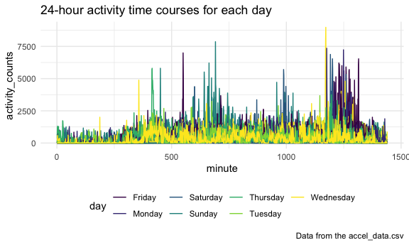

p8105\_hw3\_jh4324
================
Jiying Han

This is my solutions of homework 3

## Problem 1

``` r
data("instacart")
```

This dataset contains 1384617 rows and 15 columns.

Observations are the level of items in orders by user. there are user/
order variables – user ID, order ID, order day, and order hour. There
are also item variables – name, aisle, department, and some numeric
codes.

  - 1.How many aisles are there, and which aisles are the most items
    ordered from?

<!-- end list -->

``` r
instacart %>% 
  count(aisle) %>% 
  arrange(desc(n))
```

    ## # A tibble: 134 x 2
    ##    aisle                              n
    ##    <chr>                          <int>
    ##  1 fresh vegetables              150609
    ##  2 fresh fruits                  150473
    ##  3 packaged vegetables fruits     78493
    ##  4 yogurt                         55240
    ##  5 packaged cheese                41699
    ##  6 water seltzer sparkling water  36617
    ##  7 milk                           32644
    ##  8 chips pretzels                 31269
    ##  9 soy lactosefree                26240
    ## 10 bread                          23635
    ## # … with 124 more rows

There are `n nrow(aisle)` aisles and the most items ordered aisle is
fresh vegetables.

  - 2.Make a plot that shows the number of items ordered in each aisle,
    limiting this to aisles with more than 10000 items ordered. Arrange
    aisles sensibly, and organize your plot so others can read it.

<!-- end list -->

``` r
instacart %>% 
  count(aisle) %>% 
  filter(n > 10000) %>% 
  mutate(
    aisle = factor(aisle),
    aisle = fct_reorder(aisle, n)
  ) %>% 
  ggplot( aes(x = aisle, y = n)) + 
  theme(axis.text.x = element_text(angle = 270, vjust = 0.5, hjust = 1)) +
  geom_point()
```


  - 3.Make a table showing the three most popular items in each of the
    aisles “baking ingredients”, “dog food care”, and “packaged
    vegetables fruits”. Include the number of times each item is ordered
    in your table.

<!-- end list -->

``` r
instacart %>% 
  filter(aisle %in% c("baking ingredients", "dog food care", "packaged vegetables fruits")) %>%  # use in 
  group_by(aisle) %>% 
  count(product_name) %>% 
  mutate(
    rank = min_rank(desc(n))
  ) %>% 
  filter(rank < 4) %>% 
  arrange(aisle, rank) %>% 
  knitr::kable() #print the table
```

| aisle                      | product\_name                                 |    n | rank |
| :------------------------- | :-------------------------------------------- | ---: | ---: |
| baking ingredients         | Light Brown Sugar                             |  499 |    1 |
| baking ingredients         | Pure Baking Soda                              |  387 |    2 |
| baking ingredients         | Cane Sugar                                    |  336 |    3 |
| dog food care              | Snack Sticks Chicken & Rice Recipe Dog Treats |   30 |    1 |
| dog food care              | Organix Chicken & Brown Rice Recipe           |   28 |    2 |
| dog food care              | Small Dog Biscuits                            |   26 |    3 |
| packaged vegetables fruits | Organic Baby Spinach                          | 9784 |    1 |
| packaged vegetables fruits | Organic Raspberries                           | 5546 |    2 |
| packaged vegetables fruits | Organic Blueberries                           | 4966 |    3 |

  - 4.Make a table showing the mean hour of the day at which Pink Lady
    Apples and Coffee Ice Cream are ordered on each day of the week;
    format this table for human readers (i.e. produce a 2 x 7 table).

<!-- end list -->

``` r
instacart %>% 
  filter(
   product_name %in% c("Pink Lady Apples","Coffee Ice Cream") 
  ) %>% 
  group_by(product_name, order_dow) %>% 
  summarize( mean_hour = mean(order_hour_of_day)) %>% 
  pivot_wider(
    names_from = order_dow,
    values_from = mean_hour
  ) %>% 
  knitr::kable()
```

    ## `summarise()` regrouping output by 'product_name' (override with `.groups` argument)

| product\_name    |        0 |        1 |        2 |        3 |        4 |        5 |        6 |
| :--------------- | -------: | -------: | -------: | -------: | -------: | -------: | -------: |
| Coffee Ice Cream | 13.77419 | 14.31579 | 15.38095 | 15.31818 | 15.21739 | 12.26316 | 13.83333 |
| Pink Lady Apples | 13.44118 | 11.36000 | 11.70213 | 14.25000 | 11.55172 | 12.78431 | 11.93750 |

## Problem 2

``` r
acc_data = 
  read_csv("./data/accel_data.csv")
```

    ## Parsed with column specification:
    ## cols(
    ##   .default = col_double(),
    ##   day = col_character()
    ## )

    ## See spec(...) for full column specifications.

  - 1.Load, tidy, and otherwise wrangle the data. Your final dataset
    should include all originally observed variables and values; have
    useful variable names; include a weekday vs weekend variable; and
    encode data with reasonable variable classes. Describe the resulting
    dataset (e.g. what variables exist, how many observations, etc).

<!-- end list -->

``` r
acc_tidy_data = 
  pivot_longer(
    acc_data,
    activity.1 : activity.1440,
    names_to = "minute",
    names_prefix = "activity.", 
    values_to = "activity_counts"
              ) %>% 
    mutate(
      weekday = case_when(
      day %in% c("Monday","Tuesday","Wednesday","Thursday","Friday") ~ "weekday",
      day %in% c("Saturday","Sunday") ~ "weekend")
    ) %>% 
    mutate(
    day = as.factor(day),
    weekday = as.factor(weekday),
    minute = as.numeric(minute)
          )
```

This dataset is has 50400 observations, 6. It contains week, day\_id,
day, minute, activity\_counts, weekday variables.

  - 2.Traditional analyses of accelerometer data focus on the total
    activity over the day. Using your tidied dataset, aggregate accross
    minutes to create a total activity variable for each day, and create
    a table showing these totals.

Are any trends apparent?

``` r
acc_trad_df =
  acc_tidy_data %>% 
  group_by(week,day) %>% 
  summarize(
    total_activity = sum(activity_counts)
   ) %>% 
  pivot_wider(
    names_from = week, 
    names_prefix = "week",
    values_from = total_activity
  )
```

    ## `summarise()` regrouping output by 'week' (override with `.groups` argument)

``` r
knitr::kable(acc_trad_df)
```

| day       |     week1 |  week2 |  week3 |  week4 |  week5 |
| :-------- | --------: | -----: | -----: | -----: | -----: |
| Friday    | 480542.62 | 568839 | 467420 | 154049 | 620860 |
| Monday    |  78828.07 | 295431 | 685910 | 409450 | 389080 |
| Saturday  | 376254.00 | 607175 | 382928 |   1440 |   1440 |
| Sunday    | 631105.00 | 422018 | 467052 | 260617 | 138421 |
| Thursday  | 355923.64 | 474048 | 371230 | 340291 | 549658 |
| Tuesday   | 307094.24 | 423245 | 381507 | 319568 | 367824 |
| Wednesday | 340115.01 | 440962 | 468869 | 434460 | 445366 |

Generally, I can’t get the apparent trend from this table, but I can
extract some information:

(1). In week one, this patient did the largest amount of activities on
Sunday, in week 2, he did the largest count activities on Saturday, in
week 3, he did the most on Monday, in week 4, it’s on Wednesday and in
week 5, it’s on Friday. Thus, although it’s not obvious, he usually does
the largest counts of activities on weekdays.

(2). In general, he did the most counts of activities on week 1 compared
with the rest 4 weeks.

(3). Here is the trend,

``` 
 week 1 : the overall trend is the activity accoutns increasing from Monday to Sunday. (Friday is an exception)
 
 week 2 : the overall trend is the activity accoutns increasing from Monday to Sunday.
 
 week 3 : the overall trend is the activity accoutns decreasing from Monday to Sunday.
 
 week 4 : there is no trend, and it seems that one day the count is high, the next day the count is relatively low
 
 week 5 : the trend from Monday to Friday is increasing, however, in weekend, it's vey low.
```

  - 3.Accelerometer data allows the inspection activity over the course
    of the day. Make a single-panel plot that shows the 24-hour activity
    time courses for each day and use color to indicate day of the week.
    Describe in words any patterns or conclusions you can make based on
    this graph

<!-- end list -->

``` r
inspec_plot = 
  acc_tidy_data %>%
  select(
    day_id,minute,activity_counts, day
  ) %>% 
  ggplot(aes(x = minute, y = activity_counts, color = day, group = day_id)) +   
  geom_path() +
  labs(
    title = "24-hour activity time courses for each day",
    caption = "Data from the accel_data.csv"
  )  
ggsave("24-hour activity time courses for each day.pdf",inspec_plot, width = 8, height = 5)

knitr::opts_chunk$set(
  fig.width = 6,
  fig.asp = .6,
  out.width = "90%"
)

inspec_plot
```



Generally, on Wednesdays this patient tends to have low activity load,
and on Friday tends to have heavy activity load in the evening. Most of
the activities focus on moon and evening.

## Problem 3

  - 1.Do some data cleaning. Create separate variables for year, month,
    and day. Ensure observations for temperature, precipitation, and
    snowfall are given in reasonable units. For snowfall, what are the
    most commonly observed values? Why?

<!-- end list -->

``` r
data("ny_noaa") 
noaany_df =
  ny_noaa %>% 
  mutate_at(
    vars(date), as.factor
          ) %>% 
  separate( date, into = c("year", "month", "day"), sep = "-", ) %>% 
  mutate_at(
    vars(year,month,day), as.factor
           ) %>% 
  mutate_at(
    vars(tmax, tmin, prcp, snow, snwd), as.numeric
  ) %>% 
  mutate(
    prcp = prcp / 10,
    tmax = tmax / 10,
    tmin = tmin / 10
  ) 

noaany_df %>% 
  drop_na() %>% 
  count(snow) %>% 
  arrange(desc(n))
```

    ## # A tibble: 248 x 2
    ##     snow       n
    ##    <dbl>   <int>
    ##  1     0 1112758
    ##  2    25   15809
    ##  3    13   12460
    ##  4    51    9252
    ##  5     5    5669
    ##  6     8    5380
    ##  7    76    5296
    ##  8     3    5276
    ##  9    38    5050
    ## 10   102    3386
    ## # … with 238 more rows

The most commonly observed is `0`, because NYC doesn’t snow for most of
the time. The second commonly observed is `25` and the third is `13` .

  - 2.Make a two-panel plot showing the average max temperature in
    January and in July in each station across years. Is there any
    observable / interpretable structure? Any outliers?

There are some outliers and most of the outliers in July are farther
away from center than Jan’s. Plus, the overall average max temperatures
in Jan are lower than July’s, although there are some overlapping. The
range of average max temperatures in Jan are bigger than July"s.

``` r
jvj_plot =
  noaany_df %>%
  filter(
    month %in% c("07", "01")
        ) %>% 
  group_by(id, month, year, tmax) %>% 
  summarize(
    mean_tmax = mean(tmax, na.rm=TRUE)
  ) %>%
  drop_na() %>% 
  ggplot(aes(x = year, y = mean_tmax, color = id)) +
  geom_point(alpha = 0.5) + 
  geom_path(alpha = 0.3) +
  theme(legend.position="none") +
  theme(axis.text.x = element_text(angle = 270, vjust = 0.5, hjust = 1)) +
  facet_grid(. ~ month) +
  labs(
    title = "Average max temperature in January and in July",
    sutitle = "NYC data from 1998 to 2008",
    caption = "Data from ny_noaa dataset"
  ) 
```

    ## `summarise()` regrouping output by 'id', 'month', 'year' (override with `.groups` argument)

``` r
 ggsave("Average max temperature in January and in July.pdf",jvj_plot, width = 8, height = 5)

knitr::opts_chunk$set(
  fig.width = 6,
  fig.asp = .6,
  out.width = "90%"
) 

jvj_plot 
```


  - 3.Make a two-panel plot showing

  - 1.  tmax vs tmin for the full dataset

<!-- end list -->

``` r
maxin_plot = noaany_df %>% 
  drop_na(tmin,tmax) %>% 
  ggplot(aes(x = tmax, y = tmin)) + 
  geom_bin2d() +
  labs(
   title = "tmax vs tmin" ,
   sutitle = "NYC data from 1998 to 2008",
   caption = "Data from ny_noaa dataset"
  )

 ggsave("tmax vs tmin.pdf",maxin_plot, width = 8, height = 5)

knitr::opts_chunk$set(
  fig.width = 6,
  fig.asp = .6,
  out.width = "90%"
) 

maxin_plot
```


  - 2.  make a plot showing the distribution of snowfall values greater
        than 0 and less than 100 separately by year.

<!-- end list -->

``` r
snow_df =
  noaany_df %>% 
  filter(
    snow > 0, 
    snow < 100
  ) 
snow_plot = 
  snow_df %>% 
  ggplot(aes(x = year, y = snow)) + 
  geom_violin(aes(fill = year), alpha = .5) +
  stat_summary(fun = "median", color = "blue") +
  theme(axis.text.x = element_text(angle = 270, vjust = 0.5, hjust = 1))+
  labs(
    title = "Distribution of snowfall values",
    subtitle = "snowfall values greater than 0 and less than 100",
    caption = "Data from ny_noaa dataset"
  ) +
  scale_y_continuous(
    breaks = c(0, 50, 100), 
    labels = c("0 mm", "50 mm", "100 mm"))
  
ggsave("Distribution of snowfall values.pdf",snow_plot, width = 8, height = 5)
```

    ## Warning: Removed 30 rows containing missing values (geom_segment).

``` r
knitr::opts_chunk$set(
  fig.width = 6,
  fig.asp = .6,
  out.width = "90%"
)

snow_plot
```

    ## Warning: Removed 30 rows containing missing values (geom_segment).


  - 4.merge the two plots

<!-- end list -->

``` r
library(patchwork)
merg_plot = maxin_plot + snow_plot 

 ggsave("imagines from noaa_ny.pdf",merg_plot, width = 20, height = 10 )
```

    ## Warning: Removed 30 rows containing missing values (geom_segment).

``` r
 knitr::opts_chunk$set(
  fig.width = 10,
  fig.asp = .9,
  out.width = "90%"
)

 merg_plot
```

    ## Warning: Removed 30 rows containing missing values (geom_segment).


As for missing value and its extent, here are the proprotion of missing
value in each variable.

``` r
ny_noaa %>% 
  summarise(tmax_na = (sum(is.na(tmax)))/nrow(ny_noaa),
            tmin_na = (sum(is.na(tmin)))/nrow(ny_noaa),
            prcp_na = (sum(is.na(prcp)))/nrow(ny_noaa),
            snow_na = (sum(is.na(snow)))/nrow(ny_noaa),
            snwd_na = (sum(is.na(snwd)))/nrow(ny_noaa))
```

    ## # A tibble: 1 x 5
    ##   tmax_na tmin_na prcp_na snow_na snwd_na
    ##     <dbl>   <dbl>   <dbl>   <dbl>   <dbl>
    ## 1   0.437   0.437  0.0562   0.147   0.228

``` r
dist = distinct(ny_noaa, id)
```
